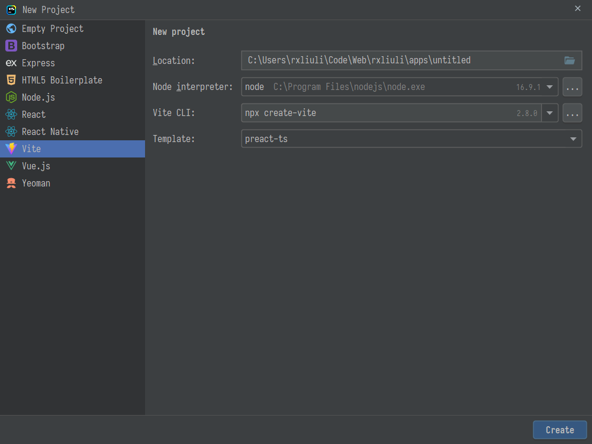
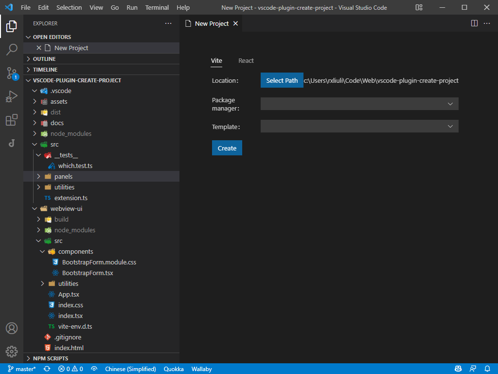

# new-project

This is a vscode visual project creation plugin that attempts to provide a project creation panel in vscode similar to jetbrains ide. Currently only projects created with vite/create-react-app are supported, but more support is expected, along with support for customizing the type of projects created.

Here is a comparison of webstorm and vscode plugins

