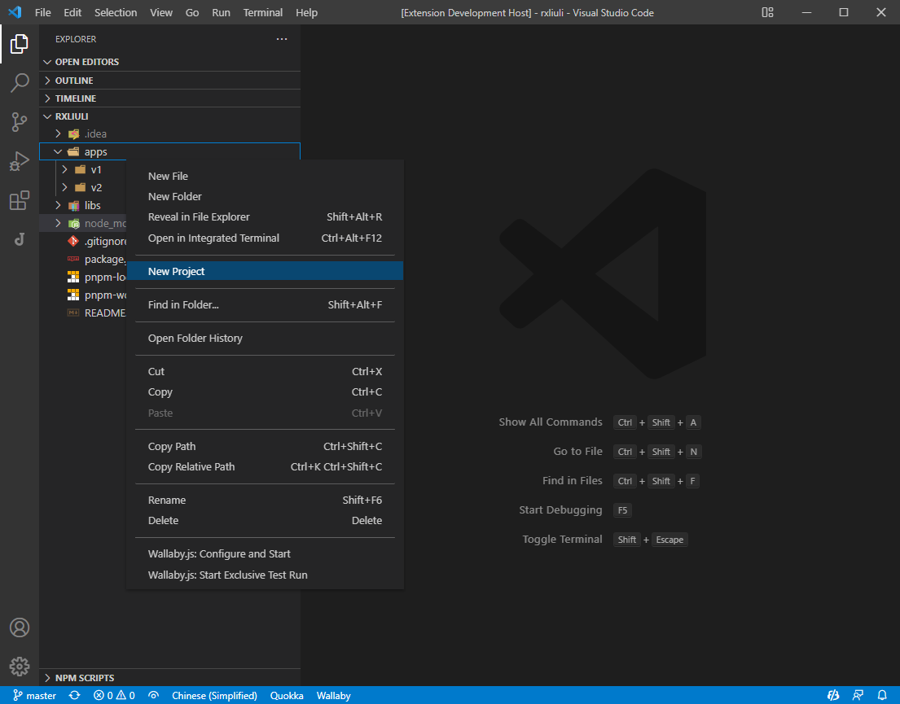

# new-project

这是一个 vscode 可视化创建项目的插件，尝试在 vscode 中提供类似于 jetbrains ide 的创建项目的面板。目前仅支持使用 `vite/create-react-app/angular/svelte` 创建项目，但支持自定义生成器。


## 使用

创建一个新项目

1. `ctrl+shift+p` 打开命令管理器
2. 输入 `New Project` 找到命令并运行

在 monorepo 中创建一个子模块

1. 在文件管理器选中目录
2. 选择 **Create Project**
3. 选择创建的项目类型



## 配置

### 选择包管理器

目前支持 `npm/pnpm`，配置项为 `newProject.packageManager`，默认是 `npm`

### 自定义生成器

你可以自行在设置中添加其他的生成器，例如下面是 [@liuli-util/cli](https://www.npmjs.com/package/@liuli-util/cli) 的生成器配置

> [更多的生成器配置示例](https://github.com/rxliuli/vscode-plugin-new-project/blob/master/webview-ui/src/assets/generators.json)

```json
{
  "newProject.generators": [
    {
      "id": "create-liuli",
      "title": "liuli",
      "package": "create-liuli",
      "command": "create-liuli",
      "configs": [
        {
          "type": "select",
          "name": "template",
          "label": "Template",
          "default": "lib",
          "options": [
            { "label": "lib", "value": "lib" },
            { "label": "cli", "value": "cli" }
          ]
        },
        {
          "type": "checkbox",
          "name": "overwrite",
          "label": "Overwrite",
          "default": true
        }
      ]
    }
  ]
}
```

完整的 schema

```json
{
  "type": "array",
  "description": "List of generators to use",
  "items": {
    "type": "object",
    "properties": {
      "id": {
        "type": "string",
        "description": "The id of the generator"
      },
      "title": {
        "type": "string",
        "description": "The title of the generator"
      },
      "package": {
        "type": "string",
        "description": "npm package"
      },
      "command": {
        "type": "string",
        "description": "command to run"
      },
      "configs": {
        "type": "array",
        "description": "configs to pass to the command",
        "items": {
          "type": "object",
          "properties": {
            "type": {
              "type": "string",
              "enum": ["select", "checkbox", "input"],
              "description": ""
            },
            "name": {
              "type": "string",
              "description": ""
            },
            "label": {
              "type": "string",
              "description": ""
            },
            "default": {},
            "options": {
              "type": "array",
              "items": {
                "type": "object",
                "properties": {
                  "label": {
                    "type": "string",
                    "description": "option label"
                  },
                  "value": {
                    "type": "string",
                    "description": "option value"
                  }
                },
                "required": ["label", "value"]
              }
            }
          },
          "required": ["type", "name", "label"]
        }
      }
    },
    "required": ["id", "title", "package", "command", "configs"]
  }
}
```

